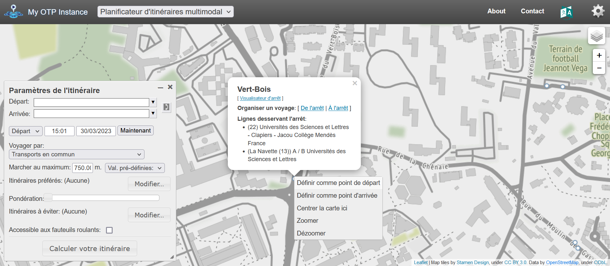
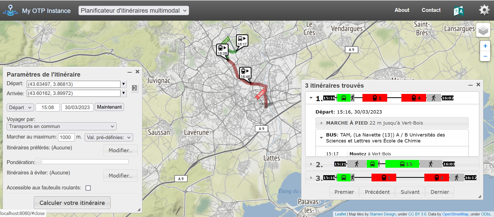
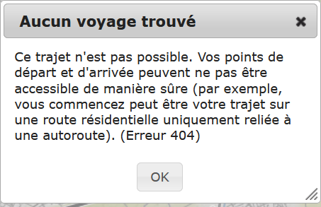
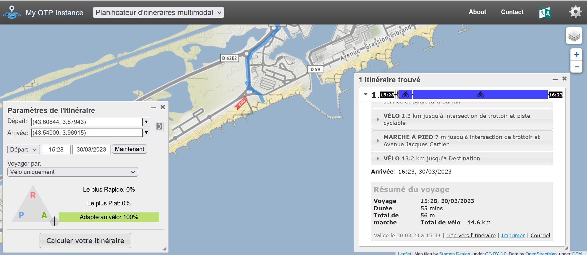
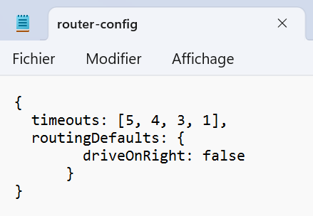

```{r setup, include=FALSE}

## Global options
knitr::opts_chunk$set(echo = TRUE,
        	            cache = FALSE,
                      prompt = FALSE,
                      comment = NA,
                      message = FALSE,
                      warning = FALSE,
                      class.source = "bg-info",
                      class.output = "bg-warning")


```

> Cette fiche présente une méthodologie d'analyse de l'accessibilité multimodale d'un territoire à partir des données GTFS et du logiciel OpenTripPlanner. Nous détaillerons la manière dont cet outil ouvre de nouvelles perspectives d'analyse de l'accessibilité en lien avec les nouvelles données de mobilité.

# Introduction

L'analyse d'accessibilité multimodale est au coeur des politiques de transport, et constitue l'un des enjeux majeurs de la planification territoriale. L'émergence de nouvelles données de suivi de l'offre de transport et d'outils adaptés à leur analyse permet aujourd'hui de porter un regard fin sur le domaine. C'est le cas de l'outil OpenTripPlanner qui fait l'objet de ce tutoriel.

Celui-ci a été construit dans le but d'accompagner son apprentissage via l'usage du langage R, et se distingue des documentations existantes par l'entrée thématique qu'il propose. Il repose sur un cas d'étude illustratif des potentialités d'analyse offertes par le croisement d'OTP et des nouvelles données de l'offre de transport : Montpellier Méditerranée Métropole.

## Accessibilité multimodale

L'accessibilité est un concept utilisé en géographie pour qualifier "la plus ou moins grande facilité avec laquelle ce lieu peut être atteint à partir d'un ou de plusieurs autres lieux, par un ou plusieurs individus susceptibles de se déplacer à l'aide de tout ou partie des moyens de transport existants" (Laurent Chapelon in [Encyclopédie Hypergeo](https://hypergeo.eu/accessibilite/)).

Étudier l'accessibilité multimodale d'un lieu ou d'un ensemble de lieux revient donc à mesurer puis à comparer les possibilités de déplacement et la pénabilité associée à ces trajets en tenant compte de l'ensemble des modes de transport disponibles : transports en commun, à pieds, à vélo, ou en voiture, notamment.

## Le projet OpenTripPlanner

[OpenTripPlanner](http://www.opentripplanner.org/) est un logiciel libre développé en Java permettant de créer et d'interroger un planificateur d'itinéraire multimodal personnalisé. Créé en 2009 par TriMet, l'agence de transport en commun de Portland (Oregon), il s'est ensuite développé, et englobe aujourd'hui une communauté mondiale d'utilisateurs et de développeurs.

L'analyse de l'accessibilité par des réseaux de transport multimodaux, opérant à différentes échelles et gérés par des autorités organisatrices variées, marque une étape importante dans le champ de la géographie des transports. Les déplacements optimaux déterminés par OTP correspondent au plus court chemin, c'est-à-dire à la minimisation du temps de déplacement pour l'usager (algorithmes de Dijkstra (@Dijkstra), A\* (@Hart1968) et assimilés). L'intermodalité au sein d'un même réseau (intramodalité) ou entre des réseaux différents est également intégrée dans OTP, avec la gestion optimale des correspondances (minimisation du temps de marche entre deux arrêts, du temps d'attente aux arrêts, etc.). OTP se prête donc aux analyses territoriales de l'accessibilité, en simulant les meilleurs déplacements possibles pour l'usager en fonction des différents modes de transport qu'il a à sa disposition pour un horaire donné.

Brièvement, OTP construit un graphe décrivant les itinéraires reliant l'ensemble des localisations d'un territoire donné, en transport en commun comme par la route, à partir de données *General Transit Feed Specification (GTFS)* pour le réseau de transport en commun (bus, métros, tramways, trains) et de données *OpenStreetMap* pour les modes de déplacement routiers (voiture, vélo, piéton). Le logiciel dépend donc de données ouvertes renseignées dans des formats de fichiers standards. Sur ce point, rappelons que les autorités organisatrices de la mobilité (AOM) ont l'obligation de transmettre leurs données de l'offre de transport (règlement européen 2017/1926, art. 25 de la LOM de 2019) sur le point d'accès national [(PAN)](https://transport.data.gouv.fr/).

Le [code source d'OTP](https://github.com/opentripplanner/OpenTripPlanner) est publié en accès libre sur la plateforme Github.

## Ressources

Les principales ressources recommandées en complément de ce tutoriel sont disponibles aux liens suivants :

-   @Morgan2019 <https://joss.theoj.org/papers/10.21105/joss.01926>

-   <https://docs.ropensci.org/opentripplanner/articles/prerequisites.html>

-   <https://docs.ropensci.org/opentripplanner/articles/advanced_features.html>

-   @Pfertner2023 <https://www.mdpi.com/2071-1050/15/3/1947>


# Les données de l'offre de transport

## Les données GTFS

### Présentation générale

L'offre de transport théorique dans un territoire peut-être étudiée à partir de données croisant les itinéraires (organisation des parcours et localisation des arrêts) et les horaires de passage des véhicules.

Deux formats de données statiques sont privilégiés :

-   NeTEx (*Network Timetable Exchange*), répondant aux critères établis par le Comité européen de normalisation en électronique et en électrotechnique ;

-   GTFS (*General Transit Feed Specification*), répondant aux critères spécifiques des flux Google Transports en commun public. Les données doivent être validées par le [validateur GTFS de Google](https://github.com/mobilitydata/gtfs-validator).

### Exemple des données de Montpellier 3M

Les données renseignant l'offre de transport théorique de TAM (Transport de l'agglomération de Montpellier) sont fournies au format GTFS depuis le point d'accès national aux données de transport à [cette adresse](https://transport.data.gouv.fr/datasets/offre-de-transport-de-montpellier-mediterranee-metropole-tam-gtfs), et peuvent être converties au format GeoJSON et au format NeTEx directement depuis le site de téléchargement.

L'extraction des données utilisées pour ce tutoriel a été réalisée le 27 mars 2023. Elles décrivent l'offre de transport de façon statique pour la période s'écoulant du 16 mars 2023 au 14 mai 2023. Les données utilisées pour ce tutoriel ont été actualisées pour la dernière fois à la date du 25 mars 2023.

Le dossier contient différents fichiers au format texte, renseignant chacun une partie du système de transport sous la forme d'un tableau de données utilisant des virgules comme séparateurs de colonnes :

-   **agency** : le fichier contient des informations sur les compagnies (*agences*) de transport en commun opérant sur le réseau étudié (ex : identifiant, nom, site web, téléphone, fuseau horaire...).

-   **routes** : le fichier catalogue les lignes du réseau de transport, qu'il décrit par le biais d'identifiants et de noms courts ou longs, par type de transport, par mode de ramassage et de descente, et d'autres informations plus ou moins formalisées. Une couleur peut être associée à une route afin d'en faciliter le repérage par les utilisateurs.

-   **trips** : le fichier décrit les itinéraires réalisés sur les routes (*lignes*), notamment par le biais d'informations sur les sens de déplacement et les dates de service (*blocks*). Plusieurs *trips* peuvent donc avoir lieu sur une même *route*.

-   **stops** : le fichier identifie, nomme, géolocalise (coordonnées lat/long) et caractérise (ex : type d'arrêt, identifiant de l'emplacement parent, accessibilité aux personnes en fauteuil roulant, ...) les arrêts du réseau.

-   **stop_times** : le fichier renseigne, pour chaque itinéraire (*trip*) concerné, les heures de passage (arrivée et départ) à l'arrêt. Des informations sur les modes de rammassage/descente, l'affichage sur les panneaux et d'autres caractéristiques des arrêts sont proposées. L'ordonnancement des passages aux arrêts pour un itinéraire particulier est également consigné.

-   **transfers** : le fichier est optionnel. Il permet de spécifier les règles de transit entre deux arrêts, en termes d'éloignement géographique et de durée de déplacement à pied, ou, comme il en est le cas avec les données de la TAM, sous la forme d'une variable catégorielle qui renseigne sur la possiblité de réaliser un transfert entre deux arrêts (transfert recommandé, programmé, possible sous contrainte de temps ou impossible).

-   **calendar** : le fichier recense les dates pour lesquelles un service est fonctionnel : une date de début et une date de fin indiquent la plage de dates d'activité du service, et, pour chaque jour de la semaine (lundi à dimanche), une variable renseigne sur la disponibilité (ou l'indisponibilité) du service pour l'ensemble des lundis (resp. mardis, mercredis, jeudis, vendredis, samedis et dimanches) de la plage. 

-   **calendar_dates** : le fichier renseigne sur les exceptions au service régulier consigné dans le fichier *calendar*. Il peut par exemple servir à indiquer les changements d'activité du service (ajout ou suppression) du fait d'un événement particulier, ou pour s'adapter à un calendrier scolaire.

De nombreuses dépendances existent donc entre les différents fichiers constituant la base de données GTFS, et ces fichiers peuvent être plus ou moins nombreux comme l'illustre le diagramme de classe proposé sur la [page Wikipédia associée](https://fr.wikipedia.org/wiki/General_Transit_Feed_Specification) et reproduite ci-dessous.

```{r, echo=FALSE, out.width="50%", fig.align = 'center'}
knitr::include_graphics("figures/gtfs_wiki.png")
```

## Les données OpenStreetMap

L'utilisation du réseau viaire (routes, chemins) est indispensable pour calculer les itinéraires des modes individuels (voiture, piéton et cycliste) et des modes collectifs (pré et post-acheminement, gestion des correspondances). Pour cela, nous utiliserons les données issues du projet de cartographie collaborative *OpenStreetMap* (OSM).

La complétude et la précision des données varient d'un territoire, d'une échelle géographique et d'une temporalité à l'autre, à ce propos on lira par exemple @Herfort2022. Il faut donc être vigilant à cet aspect en amont de leur utilisation dans le cadre d'une analyse d'accessibilité qui utilise le réseau viaire. En France, la plateforme recense l'ensemble des données géographiques publiques en Open Data en complément de l'information géographique volontaire. Une présentation des données OSM est par exemple proposée par @Mericskay2017.

### Téléchargement des données depuis la Geofabrik

La société allemande [**Geofabrik GmbH**](https://www.geofabrik.de/) propose au téléchargement des instantanés de la base de données OSM pour un espace géographique donné. L'échelle géographique la plus fine correspond aux anciennes régions françaises. Les données décrivant la métropole de Montpellier Méditerranée sont donc contenues dans le paquet décrivant le Languedoc-Roussillon.

La bibliothèque `osmextract` permet de télécharger et d'importer facilement des données *OpenStreetMap* de Geofabrik et d'autres fournisseurs depuis R.

```{r, eval=FALSE}
library(osmextract)
```

Nous allons utiliser le fichier décrivant les limites de la métropole de Montpellier 3M afin de créer un filtre spatial lors du téléchargement des données OSM depuis la Geofabrik. Pour cela, nous l'importons dans le projet en cours via la fonction `st_read()` de la bibliothèque `sf`.

Le fichier GeoJSON des communes de la métropole de Montpellier est disponible ici :

<p class="center">
[<span style="font-size: 230%;" class="glyphicon glyphicon-download-alt"></span><br/>Télécharger les données](data/EPCI_MONTPELLIER.geojson)</p>

```{r}
library(sf)
EPCI_3M <- st_read("data/EPCI_MONTPELLIER.geojson")
```

La fonction `oe_match()` de la bibliothèque `osmextract` permet d'associer par le biais d'une relation d'appartenance géographique un lieu d'entrée avec l'URL du fichier .osm.pbf correspondant, qu'elle enregistre dans une liste.

```{r, eval = FALSE}
OSM_3M_url <- oe_match(EPCI_3M) 
```

On peut alors télécharger le fichier par la biais de la fonction `oe_download()` de la bibliothèque, en indiquant l'url du fichier, sa taille et le chemin d'accès du répertoire dans lequel on souhaite consigner le fichier (par exemple, le dossier temporaire).

```{r, eval = FALSE}
oe_download(
file_url = OSM_3M_url$url,
file_size = OSM_3M_url$file_size,
#provider = "test",
download_directory = tempdir()
)
```

### Description des données osm.pbf

Le format des données ainsi téléchargées (*Protocolbuffer Binary Format*) est spécifique au projet *OpenStreetMap*, mais utilise le format de sérialisation de Google pour produire un fichier au format binaire. Il permet de regrouper des informations multiples (entités, objets, tuiles) de façon indépendante.

Par curiosité (mais cela n'est pas une étape nécessaire pour la mise en oeuvre de la chaîne de traitements), on peut importer les couches d'information géographique souhaitées une à une ou de façon groupée via la fonction `st_read()`, en spécifiant la couche (organisée par type de géométrie) et en créant une requête sur les attributs, par exemple en sélectionnant les routes (*key = highway*) dans la couche.

```{r, eval = FALSE}
OSM_highways <- sf::read_sf("C:\\Users\\33658\\AppData\\Local\\Temp\\RtmpCYFlTP\\geofabrik_languedoc-roussillon-latest.osm.pbf", layer = "lines", query = "select highway from lines")
```

## Relations entre données GTFS et données OpenStreetMap

Si un arrêt d’un GTFS se trouve dans un bâtiment, il est nécessaire d’être vigilant à sa connexion au graphe piéton, sans quoi l’isolement de l’arrêt rendra impossible les parcours à pied puisque l'impossible de créer des pré- et post-acheminements en dehors du bâtiment ne permettront pas l'identification de correspondances.

Par exemple, les cheminements piétons dans les gares ne sont pas systématiquement renseignés dans OpenStreetMap, ni les escaliers ou ascenseurs permettant de changer de quai. D’expérience, les gares les plus importantes sont correctement géoréférencées mais toutes ne le sont pas. Un arrêt isolé du graphe piéton ne permet pas au logiciel de comprendre qu’il peut entrer et sortir de la gare, ou réaliser une correspondance entre un TGV et un TER dans la même gare s’il doit se déplacer dans celle-ci, faute d’un graphe piéton disponible. 

Il nous semble que deux solutions peuvent alors être envisagées :

- Contribuer à OpenStreetMap pour ajouter les informations manquantes. Les données .osm.pbf, parmi d'autres formats disponibles, de la Geofabrik sont mises à jour tous les jours ;

- Modifier la localisation du point d’arrêt créé par le GTFS. Cela peut être intéressant pour déplacer un arrêt avec des coordonnées imprécises. Ainsi, le point peut être replacé dans un espace accessible au graphe piéton, comme l’entrée de la gare. Les coordonnées des arrêts sont rangées dans le fichier *stops*.

# Préparation de l'environnement R pour OTP

## La bibliothèque `opentripplanner`

OTP étant défini en Java, son fonctionnement nécessite l'entrée de lignes de commandes Java. La bibliothèque `opentripplaner` permet de définir les paramètres de ces fonctions depuis R et de les traduire automatiquement en Java.

La version de la bibliothèque utilisée pour ce tutoriel est la 0.5.0, publiée en janvier 2023 et téléchargée depuis le CRAN le 27 mars 2023. Son exécution nécessitera l'installation préalable de [Java 8](https://www.java.com/fr/download/) sur la machine. Attention, des conflits avec des versions postérieures ou ultérieures de Java sur votre machine sont à attendre, il est donc recommandé de désinstaller ces versions en amont de l'installation de Java 8 et du lancement d'OTP.

<div class="alert alert-danger" role="alert">
Si la désinstallation d'une version postérieure ou ultérieure à Java 8 représente un problème, il existe des solutions pour faire cohabiter plusieurs versions de Java en fonction de votre système d'exploitation : [Linux Ubuntu](https://www.baeldung.com/linux/java-choose-default-version), [Windows](https://www.happycoders.eu/java/how-to-switch-multiple-java-versions-windows/) et [MacOS X](https://notiz.dev/blog/how-to-manage-multiple-java-versions-on-mac).</div>

```{r}
library(opentripplanner)
```

Cette partie du tutoriel est basée sur la [documentation proposée par Marcus Young, Malcom Morgan et Robin Lovelace](https://docs.ropensci.org/opentripplanner/articles/opentripplanner.html), les développeurs du *package*.

## Installation d'OTP

Nous allons donc utiliser OTP en local, en téléchargeant la version 1.5 du logiciel depuis R (il s'agit de la version compatible du *package*, d'autres versions plus récentes ont vu le jour depuis).

### Création du répertoire

OTP est distribué sous la forme d'un unique fichier JAR (*Java ARchive*) exécutable de façon autonome. Dans un premier temps, nous allons créer le répertoire dans lequel l'enregistrer.

La fonction `file.path()` permet de spécifier le chemin d'accès vers un fichier en concaténant des chaînes de caractères. Par défaut, le séparateur utilisé est "`/`".

```{r}
path_data <- file.path("data/OTP")
```

### Pré-construction du fichier JAR

La fonction `otp_dl_jar()` de la bibliothèque `opentripplanner` télécharge le fichier JAR (*Java Archive*) d'OTP. Par défaut, le fichier JAR est caché dans un sous-repértoire de la bibliothèque. Si l'on souhaite spécifier la localisation du fichier JAR, il faut en indiquer le chemin d'accès (`path =`) et spécifier que l'on ne souhaite pas utiliser la cache par défaut (`cache = FALSE`).

```{r, eval = FALSE}
download_otp <- otp_dl_jar(path = path_data, cache = FALSE)
```

Il faudra penser à commenter cette ligne de code une fois le téléchargement réalisé afin de ne pas le ré-éxécuter à chaque relance du script.

Si le téléchargement du fichier via R ne fonctionne pas, vous pouvez télécharger manuellement le fichier depuis le [dépôt maven](https://repo1.maven.org/maven2/org/opentripplanner/otp/1.5.0/otp-1.5.0-shaded.jar).

On indique ensuite dans un vecteur au format "caractères" le chemin d'accès complet vers l'archive d'OTP :

```{r}
path_otp <- paste(path_data,"/otp-1.5.0-shaded.jar", sep = "")
```

## Préparation des fichiers d'entrée

En amont de la création du graphe sur lequel les calculs d'itinéraires seront réalisés par OTP, il est nécessaire de regrouper les fichiers d'entrée au sein du répertoire contenant le fichier JAR :

-   créer un sous-répertoire nommé `graphs` (/graphs)

-   à l'intérieur du sous-répertoire `graphs`, créer un nouveau sous-répertoire nommé `default` (/graphs/default)

-   dans le sous-repétoire `default`, déposer le fichier osm.pbf du Languedoc-Roussillon et le fichier contenant les données GTFS au format zippé (gtfs.zip)

## Création du graphe

Afin de construire les itinéraires, OTP reconstitue via la fonction `otp_build_graph()` un graphe des cheminements possibles à partir des données d'entrée susmentionnées. Ce graphe permettra de gagner un temps substantiel pour démarrer de nouvelles sessions d'OTP, à la manière d'une sauvegarde des réseaux.

Le paramètre `otp` indique le chemin d'accès vers l'archive java d'OTP (fichier OTP .jar).

Le paramètre `dir` indique le chemin d'accès vers le répertoire contenant les fichiers nécessaires à la génération du graphe.

Le paramètre `memory` prend un nombre entier qui renseigne sur la quantité de mémoire à attribuer à OTP (par défaut 2048 Mo). La quantité de mémoire dépend de la taille de l'espace géographique à l'étude, de la puissance de votre machine et de la version de Java utilisée (idéalement du 64 bits, vous serez limités à quelques Go si vous utilisez le 32 bits).

Le territoire métropolitain de Montpellier correspond à un espace géographique de taille intermédiaire, nous allons donc demander à utiliser 10 Go de mémoire (c'est-à-dire 10000 Mo).

Notons ici qu'OTP est optimisé pour réaliser des routages à l'échelle d'une ville et que ses performances se dégraderont avec de plus grandes zones.

```{r, eval = FALSE}
otp_build_graph(otp = path_otp, dir = path_data, memory = 10000)
```

Une fois le graphe construit, il est recommandé de passer la ligne en commentaire afin de ne pas relancer la procédure à chaque exécution du code.

## Synthèse de l'organisation du dossier OTP

Nous pouvons résumer l'organisation du dossier OTP avec ce schéma :
```{r, echo = FALSE, out.width = "50%",  fig.align = 'center'}
knitr::include_graphics("figures/schema_OTP.png")
```

Un fichier `router-config.json`, facultatif pour démarrer une session OTP, pourra être ajouté dans un second temps pour modifier des paramètres de déplacement (voir partie 4.5). Egalement, le fichier `Graph.obj` est facultatif mais il est intéressant de le créer, une fois la session OTP en fonctionnement, pour gagner du temps au demarrage pour les prochaines sessions.

Pour reproduire le prochain exemple, le répertoire OTP et les données sont disponibles ici :

<p class="center">
[<span style="font-size: 230%;" class="glyphicon glyphicon-download-alt"></span><br/>Télécharger les données](data/OTP.zip)</p>

# Lancer OTP

## Générer une instance locale du serveur OTP

Il est ensuite nécessaire d'installer une instance locale du logiciel. Nous la crééons grâce à la fonction `otp_setup()`, qui lance le calculateur d'itinéraires (*default router*) par défaut via une interface web. Cette procédure peut prendre quelques minutes.

OTP dispose d'un [serveur Web Grizzly](https://javaee.github.io/grizzly/) intégré qui s'exécute sur les ports 8080 (http) et 8081 (https). Les options `port` et `securePort` de la fonction permettent d'indiquer des ports alternatifs si les ports par défaut sont utilisés par d'autres applications en cours.

```{r}
otp_setup(otp = path_otp, dir = path_data)
```

La session d'OTP est alors démarrée en local, et une fenêtre s'ouvre dans un navigateur Web afin d'accéder à l'interface graphique du logiciel.

```{r, echo = FALSE, out.width = "100%",  fig.align = 'center'}
knitr::include_graphics("figures/localOTP.png")
```

L'interface graphique de l'application Web d'OTP permet de zoomer/dézoomer sur l'espace d'étude, de spécifier des dates et des temps de trajet, le mode de transport à considérer (et d'en paramétrer l'usage), ou encore de modifier le fond de carte.

## Paramétrer une requête depuis l'interface graphique

Pour rechercher un itinéraire depuis OTP, il est possible de désigner les lieux d'origine et de destination par leurs couples de coordonnées de longitude et de latitude ou de renseigner des noms d'arrêts issus des données d'entrée.

Pour définir un point de départ, sans en connaître les coordonnées de longitude/latitude ou le nom d'arrêt au préalable, il est possible de le sélectionner directement depuis la fenêtre graphique comme suit :

```{r, echo = FALSE, out.width = "100%",  fig.align = 'center'}

```

<div class="alert alert-success" role="alert">
Nous allons dans un premier temps rechercher les itinéraires possibles en transport en commun entre les arrêts de transport en commun Vert-Bois et Port-Marianne, respectant des distances à pieds maximales de 1000m et étant disponibles au moment de la requête (**ex : le 30 mars 2023, à 15h08**).</div>

```{r, echo = FALSE, out.width = "100%",  fig.align = 'center'}

```

Notons ici l'importance des bornes temporelles de validité des fichiers GTFS dans l'obtention d'une réponse à une requête. OTP ne sera en effet pas en capacité de trouver un trajet pour des périodes en amont ou en aval des dates renseignées dans le fichier **calendar**.

D'autres paramétrages sont directement accessibles depuis l'interface, comme l'illustre l'exemple ci-dessous.

<div class="alert alert-success" role="alert">
Nous paramétrons les cheminements piétons en renseignant une distance maximale de marche de 100m.</div>

```{r, echo = FALSE, out.width = "50%",  fig.align = 'center'}

```

<div class="alert alert-success" role="alert">
Nous pouvons également paramétrer les profils d'itinéraires cyclables (selon des critères de rapidité du trajet, d'adaptabilité au vélo et d'élévation du terrain), par exemple pour se rendre de la place de la Comédie à la plage du Prevost.</div>

```{r, echo = FALSE, out.width = "100%",  fig.align = 'center'}
knitr::include_graphics("figures/Itineraire2.png")
```

<div class="alert alert-success" role="alert">
On peut aisément calculer l'impact du choix d'un itinéraire 100% adapté au vélo sur la durée de ce trajet.</div>

```{r, echo = FALSE, out.width = "100%",  fig.align = 'center'}

```

## Connecter R à l'instance locale d'OTP

Afin d'automatiser les procédures, il est intéressant d'exécuter OTP depuis R, en lui soumettant des lignes de commande personnalisées.

La fonction `otp_connect()` permet de tester et de créer une connexion à OTP depuis R. Plusieurs paramètres peuvent lui être passés en option, tel que le fuseau horaire (*timezone*) à partir duquel construire les requêtes (par défaut, la valeur est celle de votre machine), la version d'OTP (par défaut, la version renseignée est 1.5), ou encore le port utilisé pour la connexion (par défaut, le numéro de port utilisé est 8080).

```{r}
my_otpcon <- otp_connect(timezone = "Europe/Paris")
```

## Arrêter l'instance locale d'OTP

Le lancement d'OTP a automatiquement démarré Java, qui s'exécute donc hors de l'environnement R. Il faut donc penser à arrêter OTP et Java lorsque l'on quitte la session R à partir de laquelle une session OTP avait été lancée. On utilise pour cela fonction `otp_stop()`.

Un message s'affiche, afin de valider la clotûre de Java induite par la commande `otp_stop()` : "*This will force Java to close, Press [enter] to continue, [escape] to abort*". Notons ici qu'en pressant sur `[enter]`, toutes les applications utilisant Java seront arrêtées.

```{r, eval = FALSE}
otp_stop()
```

## Configurer les options de déplacement

### Créer manuellement les fichiers de configuration

OTP permet de [configurer les options de déplacement à prendre en compte lors du déploiement de l'application](http://docs.opentripplanner.org/en/latest/Configuration) (version personnalisée d'OTP) à l'aide de trois types de fichiers au format *JavaScript Object Notation* (json) :

-   `build-config.json` renseigne les éléments indispensables à la génération du graphe, par exemple en spécifiant les fichiers GTFS sources pour différents systèmes de transports en commun fonctionnant sur le territoire ou en indiquant que l'on souhaite que les transferts entre arrêts d'une même station de transport (par exemple, de métro) soient privilégiés :

```{r, echo = FALSE, out.width = "50%",  fig.align = 'center'}
knitr::include_graphics("figures/build_config1.png")
```

-   `router-config.json` contient des options de configuration d'exécution mobilisées lors du *setup* (i.e. `otp_setup()`) qui peuvent donc être modifiées une fois le graphe construit. On peut par exemple  spécifier les durées maximales de recherche d'un itinéraire et de ses alternatives avec l'option `timeouts` ou modifier le sens de circulation par défaut sur le réseau routier par l'option `driveOnRight: false` :

```{r, echo = FALSE, out.width = "50%",  fig.align = 'center'}

```

-   `otp-config.json` contient des commutateurs simples qui activent ou désactivent les fonctionnalités à l'échelle du système. La plupart des applications ne nécessitent pas la modification de ce fichier.

De nombreux paramètres peuvent ainsi être ajoutés dans le fichier de configuration du serveur OTP (voir une présentation [ici](https://docs.opentripplanner.org/en/v1.5.0/Configuration/)). Des exemples de fichiers de configuration sont disponibles [ici](https://github.com/opentripplanner/OpenTripPlanner/tree/dev-2.x/docs/examples). Notons toutefois qu'OTP fournit des valeurs par défaut qu'il définit comme étant *raisonnables*. Les trois fichiers sont donc optionnels, tout comme les options à l'intérieur de chacun.

### Modifier les paramètres via des fonctions R

La bibliothèque `opentripplanner` propose plusieurs fonctionnalités afin de faciliter la configuration de l'instance OTP.

La fonction `otp_make_config()` crée un fichier de configuration, de type `router`, `build` ou `otp`.

```{r}
router_config <- otp_make_config(type = "router")  
```

Le fichier est organisé sous la forme de quatre listes, comprenant chacune un ensemble d'objets :

-   `$routingDefaults` : liste la série de paramètres par défaut, par exemple la vitesse de marche (`$routingDefaults$walkSpeed`) ;

-   `$boardTimes` : liste les paramètres de configuration des temps d'embarquement par mode de transport ;

-   `$alightTimes` : liste les paramètres de configuration des temps de démarrage par mode de transport ;

-   `$timeouts` : liste les délais maximums de calcul des 1er, 2e, 3e, etc. itinéraires.

<div class="alert alert-success" role="alert">
On peut ainsi facilement remplacer une valeur par défaut, par exemple en modifiant la vitesse de marche (de 1,34 mètres par seconde) pour une allure de marche de type promenade, qui équivaudrait à 3km/h. On obtient une vitesse en m/s en divisant une vitesse en km/h par 3.6 : 3km/h $=$ 0,84 m/s.</div>

```{r}
router_config$routingDefaults$walkSpeed <- as.numeric(0.84)
```

<div class="alert alert-success" role="alert">
Nous modifions également le paramètre définissant le temps de parking d'un vélo, en passant de `NULL` à 120 secondes.</div>

```{r}
router_config$routingDefaults$bikeParkTime <- as.integer(120)
```

La fonction `otp_validate_config()` génère des tests de validité d'un l'objet de configuration. Un problème régulièrement rencontré est l'erreur de typage des paramètres de la fonction (*integer*, *numeric*, etc.).

```{r}
otp_validate_config(router_config)
```

Une fois le paramètrage du fichier de configuration finalisé, la fonction `otp_write_config()` permet de l'exporter au format JSON.

```{r}
otp_write_config(router_config,                
                 dir = path_data,
                 router = "default")
```

Les configurations du routeur sont prises en compte lors du lancement du serveur OTP et ne peuvent être mobilisées alors qu'une session est en cours. Nous allons donc nous déconnecter puis nous reconnecter à l'instance locale d'OTP pour pouvoir en tenir compte lors de nos analyses.

```{r,eval = FALSE}
otp_stop()

otp_setup(otp = path_otp, dir = path_data, router = "default")

my_otpcon <- otp_connect(timezone = "Europe/Paris", router = "default")
```

<div class="alert alert-success" role="alert">
Afin de vérifier la bonne prise en compte des paramètres de configuration, nous allons calculer la vitesse moyenne de l'itinéraire piéton séparant la place de la Comédie de la plage du Prevost.</div>

```{r,eval = FALSE}
route_bis <- otp_plan(otpcon = my_otpcon, 
                  fromPlace = c(3.87943, 43.60844), 
                  toPlace = c(3.96915, 43.54009),
                  mode = "WALK",
                  date_time = as.POSIXct("2023-04-19 10:15:00"))

route$walkDistance/route$duration
```

# Création d'itinéraires

Les recherches d'itinéraires constituent un premier levier d'analyse de l'accessibilité d'un lieu ou d'un ensemble de lieux depuis un ou plusieurs points de départ.

<div class="alert alert-danger" role="alert">
<b>Point de vigilance pour les requêtes concernant les horaires de l'après-midi.</b> En fonction des paramètres de votre logiciel R, il est possible que les horaires de l'après-midi se convertissent automatiquement comme le matin. Par exemple `date_time = as.POSIXct("2023-04-19 14:15:00")` pourrait requêter à 2h15 du matin au lieu de 14h15 l'après-midi. Si c'est le cas, vous devez spécifier à chaque nouvelle session R `Sys.setlocale("LC_TIME", "en_US.UTF-8")` dans la console. La résolution du problème a été découverte [ici](https://github.com/ropensci/opentripplanner/issues/85).</div>

## Requête unique

La fonction `otp_plan()` permet d'obtenir un ou des itinéraires connectant un point d'origine (`fromPlace`) à un point d'arrivée (`toPlace`). Tout comme sur l'interface graphique, les lieux sont définis par un couple de coordonnées de longitude et de latitude, à la différence qu'ici les latitudes sont renseignées en premier et les longitudes ensuite. On combine classiquement ces deux valeurs dans un vecteur via la fonction `c()` (*combine*).

Notons que pour utiliser des noms d'arrêts comme lieu de départ et d'arrivée, il faut remplacer les arguments `fromPlace`/`toPlace` par les arguments `fromID`/`toID`.

L'argument `otpcon` renseigne l'objet de connexion OTP produit avec la fonction `otp_connect()`.

L'argument `mode` désigne les modes de transport à considérer pour le calcul de l'itinéraire : `TRANSIT` (déplacement en transport en commun, tous modes confondus), `BUS` (déplacement en bus), `TRAM` (déplacement en tramway), `RAIL` (déplacement en train), `WALK` (déplacement piéton), `BICYCLE` (déplacement à vélo), `CAR` (déplacement en voiture), etc. Par défaut, le trajet est calculé pour un voyage en voiture.

Il est possible d'indiquer des combinaisons de modes de déplacement (parmi les [options proposées par OTP](https://docs.opentripplanner.org/en/v2.2.0/RoutingModes/)). Par exemple, une combinaison `c("CAR", "TRANSIT")` permet de décrire des trajets de type *Kiss and ride*, où un usager est déposé en voiture à une station de transport en commun sans avoir lui-même à garer le véhicule automobile. La combinaison `c("CAR_PARK", "TRANSIT")` permet quant-à-elle de décrire des trajets pour lesquels l'usager se déplace en voiture jusqu'à un parking relais à proximité d'un arrêt de transport en commun puis emprunte ce réseau.

Le paramètre `date_time` renseigne la date et l'heure de départ au format POSIXct. Par défaut, la date et le jour courants sont utilisés.

D'autres paramètres optionnels sont proposés, parmi lesquels :

-   `maxWalkDistance` qui indique le nombre de mètres maximal à parcourir à pieds sur l'ensemble du trajet ;

-   `arriveBy` qui permet de définir l'heure d'arrivée (`arriveBy = TRUE`) via le paramètre `date_time` plutôt que l'heure de départ (par défaut, `arriveBy = FALSE`) ;

-   `numItineraries` qui permet de restreindre le nombre d'itinéaires en sortie.

<div class="alert alert-success" role="alert">
Le script ci-dessous permet de reproduire la dernière requête que nous avons renseignée depuis l'interface graphique d'OTP.</div>

```{r}
route <- otp_plan(otpcon = my_otpcon, 
                  fromPlace = c(3.87943, 43.60844), 
                  toPlace = c(3.96915, 43.54009),
                  mode = "BICYCLE",
                  date_time = as.POSIXct("2023-04-19 10:15:00"))
```

Le résultat de la requête est un tableau de données (`dataframe`) décrit au format *simple features* de la bibliothèque du même nom (`sf`).

```{r}
library(DT)
datatable(route)
```

Le chemin proposé est composé de trois étapes (*legs*) de déplacement continu utilisant un même mode, recensés dans l'ordre du cheminement. La somme de leurs distances et de leurs durées correspond ainsi à la distance (en mètres) et à la durée (en secondes) du trajet total :

```{r, eval = FALSE}
sum(route$leg_distance)

sum(route$leg_duration)
```

## Requêtes multiples

L'intérêt d'instruire des requêtes OTP par lignes de commande est certainement de pouvoir générer des demandes multiples, par exemple, en étudiant les temps de trajet nécessaires pour se déplacer d'une origine à une destination à différents moments de la journée, en définissant une liste de lieux de départ pour un même lieu d'arrivée ou encore pour des plages horaires différenciées.

Le format des paramètres `fromPlace` et `toPlace` peut être varié : couple de paires de longitude/latitude, matrice à deux colonnes décrivant les paires de longitude/latitude ou encore un fichier d'information géographique au format `sf` contenant des géométries ponctuelles décrites dans le système de coordonnées 4326.

```{r}
coord_origine <- as.matrix(rbind(c(3.86459, 43.69760), c(4.01288, 43.66112)))

coord_dest <- c(3.89695, 43.59880)

route_2 <- otp_plan(otpcon = my_otpcon, 
                  fromPlace = coord_origine, 
                  toPlace = coord_dest,
                  mode = c("TRANSIT", "WALK"),
                  date_time = as.POSIXct("2023-04-19 10:15:00"))

```

La localisation des trajets peut aisément être obtenue et cartographiée. L'exemple ci-dessous utilise la fonction `annotation_map_tile()` de la bibliothèque `ggspatial` afin d'ajouter un fond à la carte générée via la fonction `geom_sf()` de la bibliothèque `ggplot2`. Nous activerons également la bibliothèque `prettymapr` qui est reliée à `ggspatial` pour afficher cette fonction.  La carte proposée n'est pas mise en page, elle permet seulement de faire un rapide diagnostic visuel. La liste des fonds de carte disponibles est accessible via la fonction `rosm::osm.types()`.

```{r, eval = FALSE}
library(ggplot2)
library(ggspatial)
library(prettymapr)

ggplot() +
  annotation_map_tile(zoom = 13) +
  geom_sf(data = route_2, col = "red", size = 1.5) +
  annotate(geom = "point", x = coord_dest[1], y = coord_dest[2], colour = "black", size = 2)
```

L'usage de l'argument `get_geometry = FALSE` dans la fonction `otp_plan()` permet, à l'inverse, *d'abandonner* leur géométrie. Cette action permet notamment de gagner en temps de calcul lorsque les lieux sur lesquels opérer les requêtes sont nombreux et que l'on s'intéresse aux attributs des trajets.

```{r}
route_3 <- otp_plan(otpcon = my_otpcon, 
                  fromPlace = coord_origine, 
                  toPlace = coord_dest,
                  mode = c("TRANSIT", "WALK"),
                  date_time = as.POSIXct("2023-04-19 10:15:00"),
                  get_geometry = FALSE)
```

<div class="alert alert-success" role="alert">
On peut par exemple seulement souhaiter construire une matrice de temps de trajets entre les origines et les destinations, comme dans l'exemple ci-dessous :</div>

```{r}
library(dplyr)

route_3b <- route_3 %>% 
  distinct(fromPlace, route_option, .keep_all = TRUE) %>%
  select(fromPlace, toPlace, duration) 

library(tidyr)

time_matrix <- pivot_wider(data = route_3b, names_from = toPlace, values_from = duration) 
  
```

On peut également choisir de ne garder au sein de la matrice que la durée de trajet minimale pour chaque couple d'origine/destination. L'usage des coordonnées géographiques pour désigner les lieux d'origine et de destination n'est ni usuel, ni pratique. Nous allons donc également les modifier.

```{r}
route_3c <- route_3 %>% 
  distinct(fromPlace, route_option, .keep_all = TRUE) %>%
  select(fromPlace, toPlace, duration) %>%
  group_by(fromPlace) %>% slice(which.min(duration))

route_3c$fromPlace <- c("Ori_1", "Ori_2")

route_3c$toPlace <- "Dest_1"

time_matrix_2 <- pivot_wider(data = route_3c, names_from = toPlace, values_from = duration)
```

Ces matrices peuvent par exemple être retranscrites graphiquement sous la forme de cercles proportionnels au temps de trajet entre les lieux.

```{r}
# passage de la matrice au format long pour faciliter sa mise en page graphique via la fonction melt de la bibliothèque reshape2
library(reshape2)

tabCont_time_matrix_2 <- melt(time_matrix_2) 

# construction d'un graphique en cercles proportionnels avec la bibliothèque ggplot2
library(ggplot2)

ggplot(tabCont_time_matrix_2, aes(x = variable,
                  y = fromPlace)) +  
  geom_point(aes(size = value), color = "blue")  +
  scale_size(range = c(2, 4),   
             breaks = c(4431, 4981), 
             labels = c("4431", "4981"), 
             name = "Temps (sec)",
             guide = "legend") +
  labs(title = "Durée estimée des trajets", 
       x = "Destination",
       y = "Origines") +
  theme_minimal() 
```

## Cartes d'itinéraires interactives

Le code ci-dessous présente un exemple de cartographie interactive réalisée avec la bibliothèque `leaflet` pour R.

Nous représenterons le déplacement calculé dans l'objet `route` de la partie 5.1. Pour centrer la carte, nous allons dans un premier temps utiliser les données géospatiales décrivant les contours de la métropole de Montpellier. Leaflet nécessitant une projection en Pseudo-Mercator, nous utilisons la fonction `st_transform()` de la librairie `sf` afin de transformer le SCR de la couche.

Les fonctions `st_centroid()` et `st_coordinates()` de la librairie `sf` permettent respectivement de définir le centroïde du polygone et d'en récupérer les coordonnées au sein d'une matrice. Les longitudes sont données dans la première colonne et les latitudes dans la seconde.

Notons que le GeoJSON `EPCI_3M` a été téléchargé et chargé dans la partie 2.2.1.

```{r}
EPCI_3M_4326 <- st_transform(EPCI_3M, 4326)

cent3M <- st_centroid(EPCI_3M_4326)

lat3M <- median(st_coordinates(cent3M)[,2])

lon3M <- median(st_coordinates(cent3M)[,1])
```

Nous faisons ensuite appel aux fonctionnalités de la bibliothèque `leaflet` afin de construire la carte interactive de l'objet `route` que nous venons de créer :

-   `setView()` permet de définir la vue de départ, en indiquant son centre géographique par un couple de coordonnées et un niveau de zoom allant de 0 (monde) à 18 (rue) ;

-   `addPolylines()` permet d'ajouter des objets géographiques de type polylignes. Par défaut, les géométries sont celles des données renseignées dans la fonction `leaflet` de génération de la carte interactive (ici l'objet route au format `sf`). On peut choisir d'ajouter des fenêtres contextuelles (*pop-up*), par exemple sous la forme d'une étiquette apparaissant au passage du curseur sur l'objet. Parmi les nombreux paramètres de mise en forme disponibles, les options `color` et `weight` permettent respectivement de contrôler la couleur et la taille (en pixel) des traits ;

-   `addProviderTiles()` permet d'ajouter un fond de carte interactif d'un des principaux fournisseurs (OpenStreeMap, CartoDB, Stamen, Thunderforest, etc.). La liste complète est accessible via la commande `names(providers)`.

```{r}
library(leaflet)

leafMap <- leaflet(data = route) %>%
  setView(lat = lat3M, lng = lon3M, zoom = 10) %>%
  addPolylines(popup = ~paste("Durée : ", round(duration/60)," minute(s)"), color = "#e31a1c", weight = 4) %>%
  addProviderTiles(providers$CartoDB.Positron)

leafMap
```

Nous pouvons également choisir de représenter les étapes du trajet par des couleurs différenciées selon le mode de déplacement. Dans un premier temps, nous associons une couleur (de la palette `Set1` proposée dans la bibliothèque `RColorBrewer`) par mode.
Il est possible de visualiser plus en détail  la deuxième étape du déplacement en entrant des coordonnées géographiques définies dans le paramètre `setView` (`setView(lat = 43.608887, lng = 3.880381)`) et en augmentant le niveau de `zoom` (`zoom = 18`).

```{r}
mycol <- colorFactor(
  palette = 'Set1',
  domain = route$leg_mode
)

leafMap <- leaflet(data = route) %>%
  setView(lat = 43.608887, lng = 3.880381, zoom = 18) %>%
  addPolylines(popup = ~paste("Durée : ", round(duration/60)," minute(s)"), color = ~mycol(leg_mode), weight = 4) %>%
  addProviderTiles(providers$CartoDB.Positron)

leafMap

```

Nous allons enfin choisir d'adapter le contenu des fenêtres contextuelles aux étapes du trajet, par exemple en affichant le mode de transport et la durée de l'étape. Pour séparer ces deux types de contenus informationnels (que nous afficherons en gras grâce à la balise HTML `<strong></strong>`), nous utiliserons la balise HTML `<br>` (*break line*) afin de créer un saut de ligne.

```{r}
leafMap <- leaflet(data = route) %>%
  setView(lat = 43.608887, lng = 3.880381, zoom = 18) %>%
  addPolylines(popup = ~paste("<strong>Durée de l'étape :</strong> ", round(leg_duration/60)," minute(s)<br>","<strong>Mode :</strong>", leg_mode), color = ~mycol(leg_mode), weight = 4) %>%
  addProviderTiles(providers$CartoDB.Positron)
```
Cliquer sur les tronçons pour obtenir les informations :
```{r}
leafMap
```

# Analyses d'accessibilité sous contrainte temporelle

Nous proposons dans ce tutoriel deux types d'analyse d'accessibilité multimodale sous contrainte temporelle parmi l'ensemble des possibilités envisageables :

- la cartographie d'isochrones de temps d'accès à un lieu à un temps donné ;

- la cartographie du nombre de déplacements réalisables et des temps moyens d'accès à un lieu pour une plage horaire donné.

## Isochrones d'accessibilité

Les cartes d'isochrones représentent des zones d'accessibilité égale (en distance ou en temps de trajet notamment) à partir d'un certain point de départ. Elles figurent généralement plusieurs zones d'accessibilité, afin de représenter les différentiels croissants de coût du trajet à mesure que l'on s'éloigne du lieu d'intérêt.

### Localiser les différentiels d'accès à un lieu selon un mode de déplacement

La fonction `otp_isochrone()` génère des cartes d'isochrone en fonction d'un mode de transport (ou de la combinaison de plusieurs modes). Les paramètres de la fonction sont identiques à ceux utilisés pour générer des itinéraires, à l'exception de l'argument `cutoffSec` qui permet de définir les bornes maximales de chaque intervalle de temps, en secondes (les valeurs doivent donc être multipliées par 60 pour représenter des temps en minutes, par 3600 pour représenter des temps en heures, etc).

```{r}
iso_gareStRoch <- otp_isochrone(otpcon = my_otpcon,
            fromPlace = c(3.880727, 43.604937),
            mode = c("WALK", "TRANSIT"),
            maxWalkDistance = 2000,
            date_time = as.POSIXct("2023-04-25 08:00:00"),
            cutoffSec = c(15, 30, 45, 60, 75, 90) * 60) 
```

Nous pouvons utiliser les fonctionnalités de cartographie interactive proposées par la bibliothèque `leaflet` pour R afin de donner à voir le résultat. Pour retrouver des temps de trajet en minutes, nous créeons une variable transformant le temps de trajet associé à l'isochrone (donné en secondes) en le divisant par 60.

```{r}
iso_gareStRoch$minutes = iso_gareStRoch$time / 60 
```

Les isochrones de distance représentant des intervalles de temps de trajet, nous allons d'abord construire la variation de teintes représentant ces différences d'ordre de grandeur.

```{r}
mycol_2 <- colorFactor(
  palette = 'Reds',
  domain = iso_gareStRoch$minutes
)
```

Nous utiliserons la fonction `addPolygons()` afin de figurer les isochrones sur le fond de carte, en introduisant de nouvelles options de mise en forme :

-   `stroke = FALSE` : permet de retirer les contours des polygones

-   `smoothFactor` : définit le niveau de simplication des géométries en fonction du zoom

-   `fillOpacity` : contrôle le niveau d'opacité (resp. transparence) du remplissage

```{r}
leafMap <- leaflet(data = iso_gareStRoch) %>%
  setView(lat = 43.604937, lng = 3.880727, zoom = 10) %>%
  addPolygons(stroke = FALSE,
              color = ~mycol_2(minutes),
              smoothFactor = 0.2,
              fillOpacity = 1) %>%
  addProviderTiles(providers$CartoDB.Positron) 

leafMap
```

Nous allons également ajouter une légende afin de faciliter la lecture de la carte.

```{r}
leafMap <- leaflet(data = iso_gareStRoch) %>%
  setView(lat = 43.604937, lng = 3.880727, zoom = 10) %>%
  addPolygons(stroke = FALSE,
              color = ~mycol_2(minutes),
              smoothFactor = 0.2,
              fillOpacity = 1) %>%
  addProviderTiles(providers$CartoDB.Positron) %>%
  addLegend("bottomright", pal = mycol_2, 
            values = ~minutes,
    title = "Temps d'accès",
    labFormat = labelFormat(suffix = " min"),
    opacity = 1)

leafMap
```

### Comparer cartographiquement les différentiels d'accès à un lieu entre deux modes

Nous pouvons aussi choisir de superposer les isochrones de temps de trajet en vélo à la carte, et proposer à l'utilisateur de basculer d'une représentation à une autre grâce au paramètre `group` proposé par Leaflet.

<div class="alert alert-success" role="alert">
Générer les isochrones d'accessibilité à la gare Saint-Roch en vélo, en utilisant les mêmes intervalles de temps (en minutes) que ceux mobilisés pour les déplacements combinant marche et transport en commun et le même moment.</div>

```{r}
iso_gareStRoch_velo <- otp_isochrone(otpcon = my_otpcon,
            fromPlace = c(3.880727, 43.604937),
            mode = "BICYCLE",
            maxWalkDistance = 2000,
            date_time = as.POSIXct("2023-04-25 08:00:00"),
            cutoffSec = c(15, 30, 45, 60, 75, 90) * 60) 

iso_gareStRoch_velo$minutes = iso_gareStRoch_velo$time / 60 
```

Pour distinguer les deux modes de déplacement sur la carte, nous construisons une progression chromatique en teintes bleues :

```{r}
mycol_3 <- colorFactor(
  palette = 'Blues',
  domain = iso_gareStRoch_velo$minutes)
```

À l'aide de l'option `group` et des fonctionnalités de contrôle des couches introduites par la fonction `addLayersControl()`, il est possible de modifier l'aspect de la carte en fonction des choix d'affichage de l'utilisateur.

```{r}
leafMap <- leaflet() %>%
  setView(lat = 43.604937, lng = 3.880727, zoom = 10) %>%
  addPolygons(data = iso_gareStRoch,
              stroke = FALSE,
              color = ~mycol_2(minutes),
              smoothFactor = 0.2,
              fillOpacity = 1, 
              group = "TRANSIT") %>%
  addPolygons(data = iso_gareStRoch_velo,
              stroke = FALSE,
              color = ~mycol_3(minutes),
              smoothFactor = 0.2,
              fillOpacity = 1, 
              group = "VELO") %>%
  addProviderTiles(providers$CartoDB.Positron) %>%
  addLayersControl(
    overlayGroups = c("TRANSIT", "VELO"),
    options = layersControlOptions(collapsed = FALSE))

leafMap
``` 

L'affichage de la légende peut également être rendu dépendant des fonctionnalités de contrôle des couches via le paramètre `group`.

```{r}
leafMap <- leaflet() %>%
  setView(lat = 43.604937, lng = 3.880727, zoom = 10) %>%
  addPolygons(data = iso_gareStRoch,
              stroke = FALSE,
              color = ~mycol_2(minutes),
              smoothFactor = 0.2,
              fillOpacity = 1, 
              group = "TRANSIT") %>%
  addPolygons(data = iso_gareStRoch_velo,
              stroke = FALSE,
              color = ~mycol_3(minutes),
              smoothFactor = 0.2,
              fillOpacity = 1, 
              group = "VELO") %>%
  addProviderTiles(providers$CartoDB.Positron) %>%
  addLayersControl(
    overlayGroups = c("TRANSIT", "VELO"),
    options = layersControlOptions(collapsed = FALSE)
  ) %>%
  addLegend("bottomright", pal = mycol_2, 
            values = iso_gareStRoch$minutes,
            title = "Temps d'accès (TC/marche)",
            labFormat = labelFormat(suffix = " min"),
            opacity = 1,
       group = "TRANSIT"
  )  %>%
  addLegend("bottomleft", pal = mycol_3, 
            values = iso_gareStRoch_velo$minutes,
    title = "Temps d'accès (vélo)",
    labFormat = labelFormat(suffix = " min"),
    opacity = 1,
    group = "VELO")

leafMap
```

## Nombre de déplacements réalisables dans un intervalle de temps

L'analyse proposée ici vise à qualifier l'offre de transport en commun entre une ou plusieurs origine(s) en direction d'une destination à partir de la mesure du nombre de déplacements réalisables et de leurs durées. Cette analyse d'accessibilité sous contrainte horaire s'inscrit dans le cadre théorique et méthodologique de la *Time-Geography* (par exemple : @Chapelon2016 ; @Conesa2012 ; @LHostis2004 ; ...).

À titre d'exemple, nous développons un programme permettant de compter tous les déplacements possibles via le réseau de la TAM à partir des 30 mairies de la métropole (hors Montpellier) pour une arrivée entre 7h et 9h à la Gare Saint-Roch. L'objectif est d'évaluer la qualité de l'offre de transport théorique à l'heure de pointe du matin (les retards potentiels liés aux accidents de circulation, aux travaux, etc. ne sont pas pris en compte). 

### Préparation des données

La localisation des 30 mairies de la métropole de Montpellier (hors Montpellier) est recueillie à partir de la base de données des équipements de l'[INSEE](https://www.insee.fr/fr/statistiques/3568638?sommaire=3568656). Les mairies correspondent aux lignes portant le code **A129** pour la variable **TYPEQU**. Dans ce tutoriel, nous utilisons une extraction de la base de données réalisée *a priori*, du fait de la lourdeur du fichier d'origine.

Les données utilisées dans cet exemple sont disponibles ici :

<p class="center">
[<span style="font-size: 230%;" class="glyphicon glyphicon-download-alt"></span><br/>Télécharger les données](data/mairies_3M.csv)</p>

```{r}
mairies <- read.csv("data/mairies_3M.csv", header = TRUE)

head(mairies)
```

Nous transformons la couche d'informations géographiques décrivant les mairies au format *dataframe* en *simple feature dataframe*, c'est-à-dire dans un format explicitement géographique grâce à la fonction `st_as_sf`.

```{r}
mairies <- st_as_sf(mairies,
                    coords = c("LAMBERT_X", "LAMBERT_Y"),
                    crs = st_crs(2154))
```

Les coordonnées géographiques étant en Lambert93, nous les traduisons en WGS84 pour OTP via la fonction `st_transform`.

```{r}
mairies <- st_transform(mairies, 4326)
```

Nous choisissons la plage horaire pour laquelle OTP réalisera toutes ses requêtes. L'horaire de départ est 6h et l'horaire de fin 9h afin de nous assurer de récolter les déplacements permettant d'arriver entre 7h et 9h à la gare St-Roch.

```{r}
temps_limite <- as.POSIXct("2023-04-19 09:00:00")

temps_debut <- as.POSIXct("2023-04-19 06:00:00")
```

Nous crééons ensuite les listes de lieux d'origine et de destination.

```{r}
coord_origine <- as.matrix(cbind(st_coordinates(mairies)[,1], st_coordinates(mairies)[,2]))

coord_dest <- c(3.88040, 43.60508)
```

### Exécution de la boucle pour récolter l'offre de transport

Nous construisons ensuite une boucle qui réalise une itération par minute supplémentaire de l'horaire de début jusqu'à l'horaire limite au cours de laquelle nous effectuons des requêtes d'itinéraires en transport en commun depuis les lieux d'origine vers le lieu de destination dont nous enregistrons successivement les caractéristiques dans un tableau de données que nous nommons `routes`.  

Cette opération peut prendre quelques minutes en fonction du nombre de traitements et d'itérations qu'OTP doit réaliser. La fonction `tryCatch()` permet à la boucle de fonctionner malgré une éventuelle erreur de connexion au serveur OTP, due à des instabilités ponctuelles.

```{r}
routes <- data.frame()

while(temps_debut < temps_limite){
  tryCatch({
    resultats <- otp_plan(otpcon = my_otpcon, 
                          fromPlace = coord_origine,
                          toPlace = coord_dest,
                          mode = c("TRANSIT", "WALK"),
                          date_time = temps_debut,
                          maxWalkDistance = 1000,
                          get_geometry = FALSE)
    temps_debut <- temps_debut + 60
    routes <- rbind(routes, resultats)
  }, error = function(e) {
    print(paste("Erreur dans la boucle :", e$message))
  })
}
```

### Mise en forme des données

Puisque nous voulons compter le nombre de déplacements possibles avec une arrivée à destination entre 7h et 9h, la période de pointe, nous supprimerons les déplacements hors-champ (arrivée avant 7h et après 9h).

```{r}
routes <- routes[!(routes$endTime < "2023-04-19 07:00:00" | routes$endTime > "2023-04-19 09:00:00"), ]
```

La boucle d'itérations a récolté un grand nombre de doublons : d'une minute à une autre, l'offre de transport renvoyée par OTP ne change pas systématiquement. De ce fait, nous sélectionnons les seuls déplacements uniques renvoyés par le serveur OTP avec la commande `distinct`. 

```{r}
tableau_resultat <- routes %>%
  semi_join(
    routes %>%
      distinct(fromPlace) %>%
      select(fromPlace))
``` 

Enfin, nous calculons la moyenne de la durée des déplacements uniques de chacune des mairies.

```{r}
tableau_resultat <- tableau_resultat %>%
  group_by(fromPlace, endTime) %>%
  summarise(duree_moy = mean(duration/60, na.rm = TRUE))%>%
  group_by(fromPlace) %>%
  summarise(nb_endTime = n_distinct(endTime), 
            duree_moy = mean(duree_moy, na.rm = TRUE))
```

Le graphique ci-dessous représente la distribution des temps de trajets moyens obtenus pour les différentes communes sous la forme d'un histogramme.

```{r}
ggplot() + geom_histogram(aes(x = tableau_resultat$duree_moy),
                          bins = 9,
                          color = "black", 
                          fill = "lightblue") +
    labs(title = "Histogramme des temps de trajets moyens obtenus pour les 30 communes", x = "Temps de trajet moyens", y = "Nombre de mairies") +
    theme_classic() # thème de fond (ici "classic")
``` 

Nous notons que la répartition des temps de trajets moyens en transport en commun depuis les mairies des communes de la métropole de Montpellier Méditerrannée vers la gare St-Roch aux heures de pointe du matin est très irrégulière et présente des écarts importants (les valeurs étant comprises entre `r min(tableau_resultat$duree_moy)` et  `r max(tableau_resultat$duree_moy)` minutes). 

### Cartographie

Nous souhaitons savoir si les différences de temps de trajets moyens s'organisent en fonction d'une logique d'éloignement géographique des communes à la ville centre. Pour cela, nous transformons préalablement l'objet `tableau_resultat` au format `dataframe` vers le format `simple feature dataframe`. 

```{r}
library(stringr)

tableau_resultat$x <- word(tableau_resultat$fromPlace, 1, sep = ",")

tableau_resultat$y <- word(tableau_resultat$fromPlace, 2, sep = ",")

tableau_resultat <- st_as_sf(tableau_resultat, coords = c("y", "x"),
                    crs = st_crs(4326))
``` 

Nous choisissons de représenter ces différentiels d'accessibilité sous forme d'une cartographie statique. Le nombre de trajets réalisables par commune est figuré par le biais de cercles proportionnels. Les durées moyennes de ces trajets sont discrétisées par classes d'intervalles égaux.

De nombreuses bibliothèques existent pour réaliser de la cartographie avec R, dont la bibliothèque phare de création de graphiques sous R : `ggplot2`.

`mapsf` a toutefois été créée en 2021 dans le but spécifique de faciliter la production de cartes thématiques conformes au règle de la sémiologie graphique sous R, à partir de données au format `sf`. Les principales fonctionnalités de la bibliothèque sont recensées dans un document graphique téléchargeable [ici](https://raw.githubusercontent.com/riatelab/mapsf/master/vignettes/web_only/img/mapsf_cheatsheet.pdf).

La fonction `mf_map()` de la bibliothèque `mapsf` est la fonction centrale du package qui permet de construire une carte au format varié à partir des paramètres :

- `x` l’objet au format sf ;

- `var` la variable à cartographier ;

- `type` le type de carte que l’on souhaite créer (`prop` pour des symboles proportionnels, `choro` pour une carte choroplèthe, `typo` pour une palette de couleurs variées, `symb` pour des symboles ponctuels différenciés, ...). Puisque nous souhaitons représenter conjointement une variable quantitative de stock et des intervalles de temps de trajets, nous choisissons le type `prop_choro` qui permet de varier la taille des figurés et leur intensité chromatique de façon synchrone.

Notons que la cartographie paginée nécessite d'utiliser des coordonnées définies dans un système de projection cartographique adapté au territoire à l'étude, ici nous utiliserons le Lambert93 (code EPSG 2154).

```{r}
tableau_resultat <- st_transform(tableau_resultat, 2154)
EPCI_3M <- st_transform(EPCI_3M, 2154)

gare_st_Roch <- data.frame(x = 3.880731, y = 43.604622)
gare_st_Roch <- st_as_sf(gare_st_Roch, coords = c("x", "y"), crs = 4326)
gare_st_Roch <- st_transform(gare_st_Roch, 2154)
gare_st_Roch$nom <- "Gare Saint-Roch"

library(mapsf)

mf_init(x = tableau_resultat, theme = "iceberg", expandBB = c(0.3, 0.3, 0.3, 0.3))

mf_map(EPCI_3M, add = TRUE)

mf_map(tableau_resultat,
       type = "prop_choro",
       var = c("nb_endTime", "duree_moy"),
       inches = 0.15,
       border = "grey50",
       lwd = 1,
       leg_pos = c("left", "right"),
       leg_title = c("Nombre", "Temps\nmoyen\n(en min)"),
       breaks = "equal",
       nbreaks = 9,
       pal = "Greens",
       leg_frame = c(TRUE, TRUE))

mf_base(gare_st_Roch,
       add = TRUE,
       col = "blue",
       cex = 2,
       pch = 15)

mf_label(gare_st_Roch,
         var = "nom",
         col = "blue",
         halo = TRUE,
         cex = 1,
         bg = "white",
         pos = c(4, 1),
         r = 0.07)

mf_layout(
  title = "Trajets mairies vers gare St-Roch",
  #subtitle = "Arrivée prévue entre 7h et 9h",
  credits = paste0(
    "Sources: OTP et TAM 2022 \n",
    "mapsf ",
    packageVersion("mapsf")
  ),
  frame = TRUE)
```

N'oubliez pas d'arrêter le serveur OTP une fois vos analyses terminées, comme il en est le cas pour ce tutoriel !

```{r, results = "hide"}
otp_stop()
```

# Conclusion

L'outil OTP et son intégration dans R permet donc de mobiliser facilement les nouvelles données de l'offre de transport et de calcul d'itinéraires multimodaux pour porter un regard affiné sur l'accessibilité territoriale, à l'aide d'indicateurs d'analyses éprouvés en géographie et en aménagement : matrices O/D, isochrones de distance, nombre de déplacements possibles sous contrainte horaire, etc.

# Perspectives
De nombreuses perspectives sont ouvertes à l'issue de ce travail, telles que l'ajout d'autres opérateurs de transport collectif pour compléter l'offre de la TAM ou encore l'addition d'un modèle numérique de terrain afin de tenir compte de la pénibilité induite par certaines pentes dans le cas des déplacements à vélo.


# Bibliographie {-}

<div id="refs"></div>

# Annexes {-}

## Info session  {-}

```{r session_info, echo = FALSE}
kableExtra::kable_styling(knitr::kable(rzine::sessionRzine()[[1]], row.names = F))
kableExtra::kable_styling(knitr::kable(rzine::sessionRzine()[[2]], row.names = F))
```

## Citation {-}

```{r Citation, echo = FALSE}
rref <- bibentry(
   bibtype = "misc",
   title = "Analyse d’accessibilité multimodale",
   subtitle = "Avec R et OpenTripPlanner",
   author = c("Marion Le Texier", "Jean-Clément Ullès"),
   doi = "10.48645/xxxxxx",
   url = "https://rzine.fr/publication_rzine/xxxxxxx/",
   keywords ="FOS: Other social sciences",
   language = "fr",
   publisher = "FR2007 CIST",
   year = 2023,
   copyright = "Creative Commons Attribution Share Alike 4.0 International")

``` 

`r capture.output(print(rref))`

### BibTex : {-}

```{r generateBibTex, echo = FALSE}

writeLines(toBibtex(rref), "cite.bib")
toBibtex(rref)

``` 

<br/>